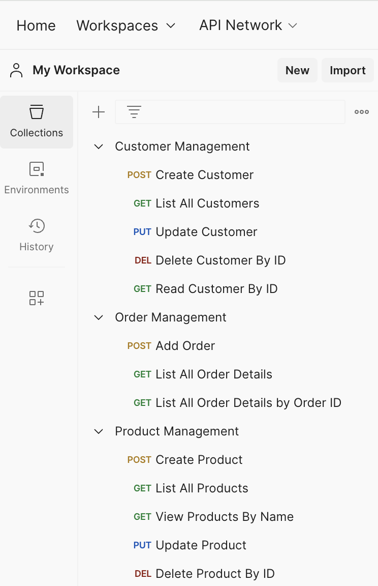
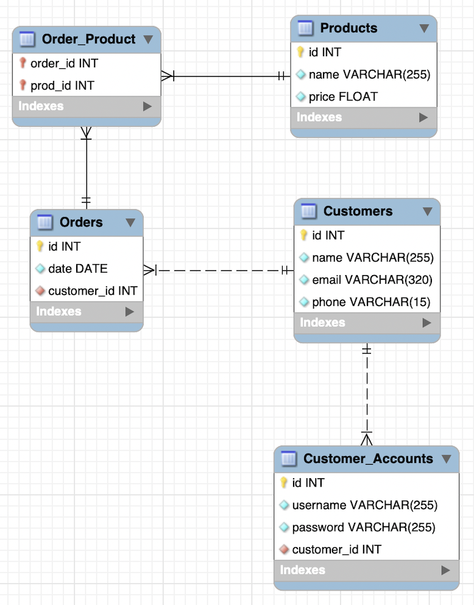

# E-commerce API
This API provides functionalities to manage Customers, Products, and Orders for a fictional e-commerce store.

## Running the Application:

1. Prerequisites:
    * Python 3.x
    * pip (Python package installer)
    * MySQL database server
    * Flask library (pip install Flask)
    * Flask-SQLAlchemy library (pip install Flask-SQLAlchemy)
    * Flask-marshmallow library (pip install Flask-Marshmallow)
    * The mysql-connector-python library (pip install mysql-connector-python)

2. Configuration:

    * Update the database connection string in the app.config['SQLALCHEMY_DATABASE_URI'] line within the code to point to your MySQL server.
    * Ensure you have created a database named e_commerce_db2 on your MySQL server.
3. Running the API:

    * Open a terminal and navigate to the directory containing the application code.
    * Run the following command to start the development server: **flask run**
    * The API will be accessible at http://127.0.0.1:5000/ by default.
## API Documentation:

**GET /customers**
* Returns the list of all customers.

**POST /customers**
* Creates a new customer
* Request body should be a JSON object with the following properties:
    * name: (String, required) - Name of the customer
    * email: (String, required) - Email address of the customer
    * phone: (String, required) - Phone number of the customer

**PUT /customers/<int:id>**
* Updates an existing customer.
* Replace <int:id> with the ID of the customer to update. Request body should be a JSON object with any of the following properties:
    * name: (String) - Name of the customer
    * email: (String) - Email address of the customer
    * phone: (String) - Phone number of the customer

**DELETE /customers/<int:id>**
* Deletes a customer.
* Replace <int:id> with the ID of the customer to delete.

**GET /products**
* Returns the list of all products.

**POST /products**
* Creates a new product. Request body should be a JSON object with the following properties:
    * name: (String, required) - Name of the product
    * price: (Float, required) - Price of the product

**PUT /products/<int:id>**
* Updates an existing product.
* Replace <int:id> with the ID of the product to update. 
* Request body should be a JSON object with any of the following properties:
    * name: (String) - Name of the product
    * price: (Float) - Price of the product

**DELETE /products/<int:id>**
* Deletes a product.
* Replace <int:id> with the ID of the product to delete.

**GET /products/by-name/<string:name>**
* Searches for products by name (partial matches allowed using wildcards).
* Replace <string:name> with the search term for product names.

**GET /customers/<int:id>**
* Get details of a specific customer.
* Replace <int:id> with the ID of the customer to retrieve.

**GET /orders** (Get Order Details)
* This functionality allows you to retrieve a list of all orders placed within the system.
* The response will be a JSON formatted list, where each element represents an individual order.
* Each order object will contain details such as the order ID, order date (i.e. date entered), customer information (including name, email, and phone number), and a list of products included in the order.

**POST /orders** (Add Order)
* This functionality allows you to create a new order within the system.
* You'll need to provide a JSON object in the request body containing the following information:
    * product_id: (Required) The ID of the product being ordered.
    * customer_id: (Required) The ID of the customer placing the order.
* If the request is successful and the product and customer IDs are valid, a new order will be created with the next order_id and an order date set to today's date.

**GET /orders/<int:order_id>** (Get Order Details by Order ID)
* This functionality allows you to retrieve the details of a specific order by providing its unique order ID.
* The response will be a JSON formatted object containing details about the order, including the order ID, order date, customer information, and a list of products associated with the order.

## User Interface:
This API was designed to be interacted with through a REST client. Postman can be used for making API requests and viewing responses. The following Postman collections were created to group related API calls for easier organization:
* Customer Management
* Product Management
* Order Management

## Error Handling:
The API will return JSON error responses with appropriate status codes (e.g., 400 for Bad Request, 404 for Not Found) in case of any validation errors or issues processing the request.

## Relationships Between Tables
